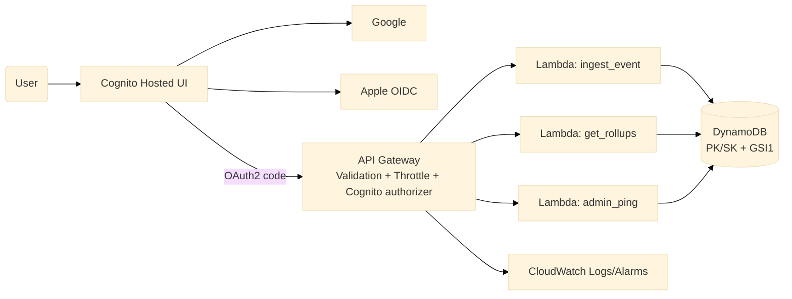

# Vetra Serverless API
Built by Adeesh Devanand — production-ready serverless backend with API Gateway, Lambda, DynamoDB, and Cognito federation (Google + Apple).

## Architecture
- Cognito Hosted UI (OAuth2 authorization code) with Cognito/Google/Apple providers.
- API Gateway (Cognito authorizer, JSON Schema validation, throttles, optional usage plan) -> Lambda.
- DynamoDB single-table (PK/SK + GSI1) with transactional ingest and rollups.
- Observability: Lambda Powertools for logging/metrics/tracing + CloudWatch alarms.

Mermaid (source in `diagram/architecture.mmd`):

Images: `diagram/architecture-placeholder.png`, `diagram/demo-placeholder.png` provide rendered placeholders for README viewers.

## Quickstart
1. **Install**: `make install`
2. **Run locally** (DynamoDB Local + SAM): `make local` (runs `scripts/run_local.sh`).
3. **Health check**: `BASE_URL=http://127.0.0.1:3000 ./examples/curl/health.sh`.
4. **Deploy to AWS**: edit `samconfig.toml` or run `./scripts/deploy.sh` with parameters for stage, callback/logout URLs, and SSM parameter names for Google/Apple secrets.
5. **Get a JWT**: follow `scripts/get_token_instructions.md` (Hosted UI auth code flow, exchange code for tokens, then call APIs with `Authorization: Bearer <id_token>`).

## Endpoints
- `GET /v1/health` public liveness.
- `POST /v1/events` protected, JSON Schema validated (API Gateway + Lambda), payload-size enforced, idempotent transactional ingest (Put event + rollup update).
- `GET /v1/rollups?from=YYYY-MM-DD&to=YYYY-MM-DD&deviceId=...` protected; returns date-range rollups and device-scoped events via GSI1.
- `GET /v1/admin/ping` admin-only (Cognito `admin` group required).

## Security & RBAC
- Cognito User Pool with Hosted UI domain, OAuth2 auth code flow, Google (built-in) + Apple (OIDC) federation.
- App Client scopes: `openid email profile`; callback/logout URLs are parameters.
- Cognito groups `user` and `admin` created via IaC; API Gateway Cognito authorizer forwards verified JWT claims. Lambdas enforce `cognito:groups` and optional `custom:tenant`.
- Secrets are pulled from SSM via dynamic references; none are stored in git.

## Validation, limits, and guardrails
- JSON Schema: API Gateway model + RequestValidator (body-only) and Lambda `jsonschema` defense-in-depth (`src/vetra/models/event_schema.json`).
- Rate limiting: Stage `MethodSettings` for burst/rate; optional Usage Plan + API key/quota via parameter `EnableUsagePlan`.
- Payload size: document API Gateway 10MB limit; Lambda hard check `MAX_BODY_BYTES` (default 64KB) returns 413.
- Observability: AWS Lambda Powertools structured logs, metrics, tracing; correlation ID via `x-correlation-id` header.
- CloudWatch alarms: Lambda errors, Lambda p95 duration, API 5XX, API throttles; log retention 14 days.

## Data model
Single table with PK/SK and GSI1. Event items use `PK=TENANT#{tenantId}#USER#{userId}`, `SK=EVENT#{day}#{ts_ms}#{eventId}`, `GSI1PK=DEVICE#{deviceId}`, `GSI1SK=TS#{ts_ms}#USER#{userId}`. Rollups live at `SK=ROLLUP#DAY#{day}` with counters map. See `docs/data-model.md` for full patterns.

## Testing & CI
- `make test` runs pytest + moto (schema rejection, RBAC denial, transactional ingest, rollup/GSI query).
- `make lint` runs ruff, black, mypy.
- GitHub Actions `ci.yml` runs on push/PR to `main`.

## Operational notes
- Deploy artifacts via `template.yaml` (SAM). Outputs: `ApiBaseUrl`, `UserPoolId`, `UserPoolDomain`, `AppClientId`, `TableName`.
- CloudWatch/X-Ray enabled for tracing and logs; alarms defined in template.
- Runbook: `docs/runbook.md`; architecture/security/API deep dives in `docs/`.